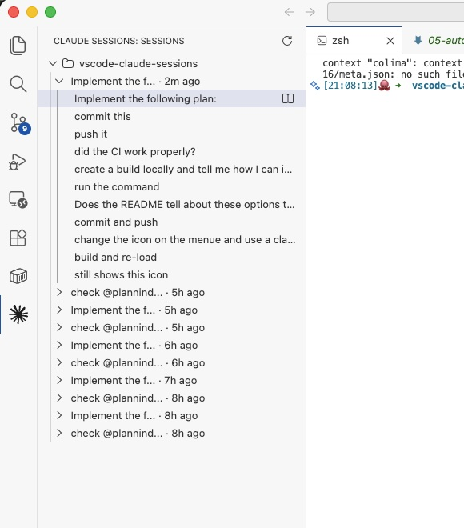
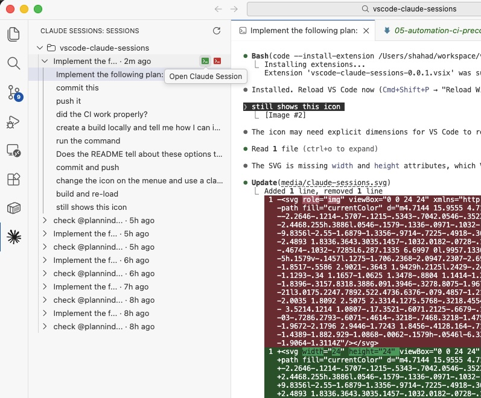
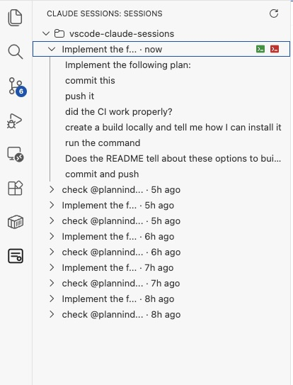
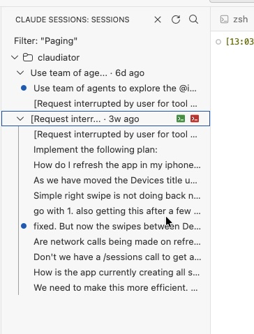
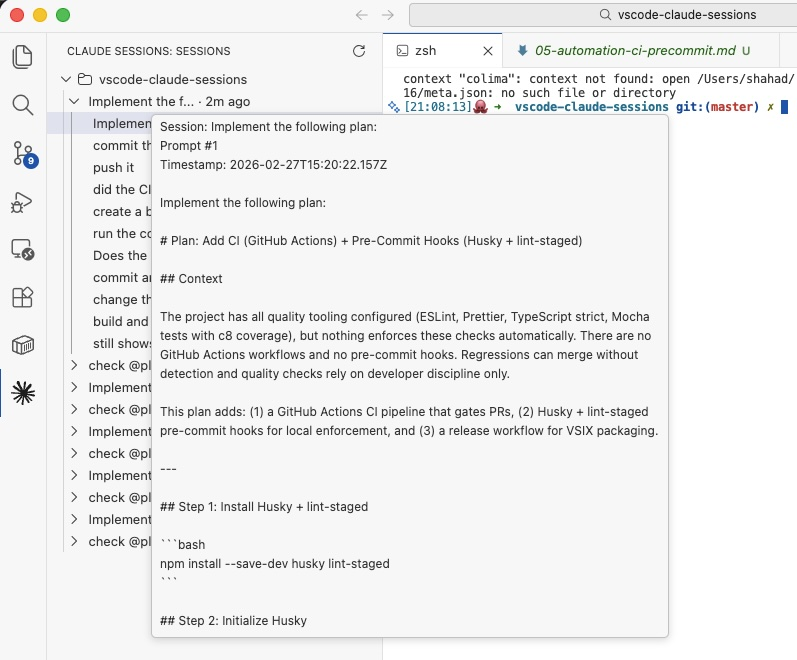

# Claude Session Explorer - A VS Code Extension

[](https://github.com/ShahadIshraq/claude-session-vs-code-extension/actions/workflows/ci.yml) [](https://github.com/ShahadIshraq/claude-session-vs-code-extension/releases) [](https://marketplace.visualstudio.com/items?itemName=ShahadIshraq.vscode-claude-sessions) [](https://marketplace.visualstudio.com/items?itemName=ShahadIshraq.vscode-claude-sessions) [](https://marketplace.visualstudio.com/items?itemName=ShahadIshraq.vscode-claude-sessions)
<br>
[](LICENSE) [](package.json) [](package.json) [](https://github.com/ShahadIshraq/claude-session-vs-code-extension/issues) [](https://github.com/ShahadIshraq/claude-session-vs-code-extension)

A VS Code extension that lets you browse Claude Code sessions for your current workspace, inspect user prompts, and resume sessions directly in a terminal.

## What It Provides

- `Claude Sessions` view in Explorer.
- `Claude Sessions` Activity Bar icon with a dedicated sidebar view.
- Lists sessions for the currently opened workspace folder(s), sourced from `~/.claude/projects`.
- Session row title + always-visible last-used token (for example `2d ago`).
- Per-session prompt list: one tree entry per user prompt in that session.
- `Open Prompt Preview` for any prompt entry (opens full prompt in a read-only virtual tab).
- `Open Claude Session` action (green terminal icon) to run:
  - `claude --resume <sessionId>`
- `Open Session (Skip Permissions)` action (red terminal icon) to run:
  - `claude --dangerously-skip-permissions --resume <sessionId>`
  - protected by a confirmation modal by default
- `Search Sessions` command: filter sessions by keyword across all prompt content.
- `Clear Filter` command: reset the search filter and show all sessions.
- `Refresh Claude Sessions` command.
- `Focus Claude Sessions View` command.

## Usage

### Session list with prompt history

Browse all Claude Code sessions for your workspace, each expandable to show individual prompts.



### Resume or open a session

Hover a session to reveal actions: resume in a terminal (green icon) or resume with `--dangerously-skip-permissions` (red icon).



### Session details with inline actions

Expand a session to see prompts and timestamps. Click the green or red terminal icons to resume.



### Search sessions

Use the search icon in the view title bar to filter sessions by keyword. Matching sessions are shown in the tree with a `Filter: "<query>"` banner. Clear the filter to restore the full list.



### Prompt preview

Click a prompt entry to open its full content in a read-only editor tab.



## Requirements

- VS Code desktop.
- Node.js 20+.
- Claude Code CLI installed and available on PATH as `claude`.
- Local Claude history at `~/.claude/projects`.

## Local Development

1. Install dependencies:

```bash
npm install
```

2. Build once:

```bash
npm run compile
```

3. (Optional) watch mode while editing:

```bash
npm run watch
```

4. Open this folder in VS Code and press `F5` to launch the Extension Development Host.

5. In the Extension Host window:

- Open the `Claude Sessions` icon in the Activity Bar, or
- Run `Focus Claude Sessions View` from Command Palette.

## Install

Download the latest `.vsix` from [GitHub Releases](https://github.com/ShahadIshraq/claude-session-vs-code-extension/releases), then install it in VS Code:

1. Open Command Palette (`Cmd+Shift+P`).
2. Run `Extensions: Install from VSIX...`.
3. Select the downloaded `.vsix` file.
4. Reload when prompted.

## Build + Install From Source

### Package as VSIX

From the project root:

```bash
npx @vscode/vsce package
```

This creates a `.vsix` file such as:

- `vscode-claude-sessions-0.0.1.vsix`

### Install VSIX

In VS Code:

1. Open Command Palette.
2. Run `Extensions: Install from VSIX...`.
3. Select the generated `.vsix` file.
4. Reload when prompted.

## Useful Commands

- `npm run compile`
- `npm run lint`
- `npm run test`

## Notes

- Prompt previews open in a WebviewPanel, so closing them does not create file delete/save prompts.
- Session prompt list filters out command-wrapper/system-noise entries (for example command metadata wrappers).
